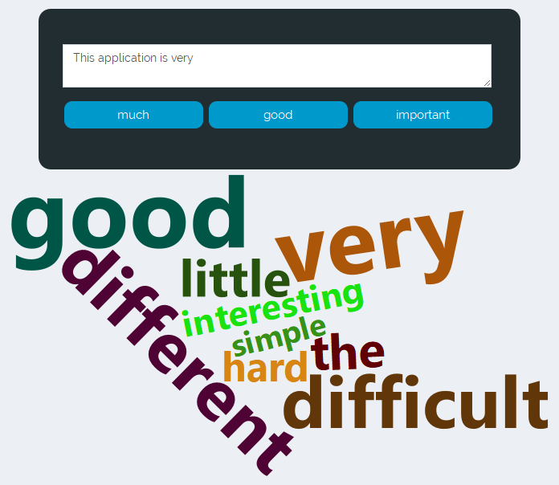

Smart Keyboard
========================================================
author: Shahyar Taheri
date: Dec 2018
autosize: true
transition: rotate

[Smart Keyboard Application](http://staheri.shinyapps.io/SmartKeyboard/) uses machine learning to predict and complete words as typing.

Introduction
========================================================

The training data used in this project are corpora that are collected from publicly available sources by a web crawler. The entries are processed, and stored based on the language and source:

|             | **Size** | **Message Count** | **Word Count** |
|-------------|----------|-------------------|----------------|
| **Blogs**   | 200 Mb   | 899.288           | 38.031.339     |
| **News**    | 196 Mb   | 77.259            | 2.643.972      |
| **Twitter** | 159 Mb   | 2.360.148         | 30.374.033     |

Data was cleaned from hastags, URLs, numbers, punctations, special characters, stop wrods, and profanities. Removing these tokens increases the model accuracy and helps with the model size and computational load.

Algorithm
========================================================

The model uses N-grams method to assign probabilities to sequence of words and predict the next word in a sentence. 

To keep the language model from assigning zero probability to unseen combinations, the Stupid backoff smoothing (discounting) is used. This method gives up the idea of trying to make the language model a true probability distribution. There is no discounting of the higher-order probabilities. 

If a higher-order N-gram has a zero count, we simply backoff to a lower order N-gram, weighed by a fixed (context-independent) weight. This algorithm does not produce a probability distribution"

At the end of the search results are cached and the words with the highest scores are selected as outputs.

 
The Shiny Application
========================================================

As user writes a sentence, the top three predictions for next possible word are shown as buttons below the text area. If the entered word is incomplete the possible word completion matching the entered characters is returned. User can click on each of the suggestions to use it as the next word.

Additionally, a word cloud of the tokens with highest probability is plotted.

Checkout [Smart Keyboard Application](http://staheri.shinyapps.io/SmartKeyboard/)

Additional Information
========================================================
To learn more about natural language processing methods used in this app refer to the following links: 

- [NLP Exploratory Analysis](https://rpubs.com/staheri/NLP-WordPrediction).  
- [N-gram Model](https://en.wikipedia.org/wiki/N-gram) 
- [Stupid Backoff Model](http://www.aclweb.org/anthology/D07-1090)
- [Knser-Ney Smoothing](https://en.wikipedia.org/wiki/Kneser%E2%80%93Ney_smoothing)
